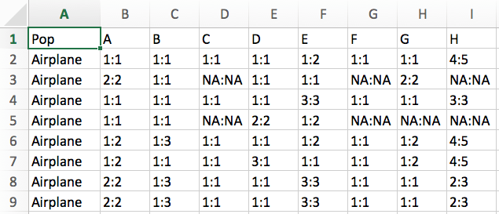

## 1. Overview of Worked Example

Author: Helene Wagner

### a) Goals 

This worked example shows:

- How microsatellite data may be coded in a spreadsheet. 
- How such a file is imported into R.
- How the data are imported into a 'genind' object using package 'adegenet'.
- How to view information stored in a 'genind' object.
- How to import the data with the 'gstudio' package.

Try modifying the code to import your own data!

### b) Data set

This code imports genetic data from 181 individuals of Colombia spotted frogs (Rana luteiventris) from 12 populations. The data are a subsample of the full data set analyzed in Funk et al. (2005) and Murphy et al. (2010). Please see the separate introduction to the data set. 

- RALU_loci_12pops.csv: File with populations and genetic data (preformatted for import, 181 rows x 9 columns).

### c) Required R libraries

This assumes the packages have been installed already. See separate instructions on installing packages, including 'gstudio' that is not available on CRAN.

Note: the function 'library' will always load the package, even if it is already loaded, whereas 'require' will only load it if it is not yet loaded. Either will work.

Here we also define 'root' as the path to the project folder, to help with accessing files from different folders within the R project. 

```{r message=FALSE, warning=TRUE}
require(adegenet)
require(gstudio)
root <- rprojroot::find_root("DGS_Week1_Lab.Rproj")
```

### d) List of tasks

- Import .csv file
- Import data with function 'read_population' from the 'gstudio' package
- Import data with function 'df2genind' from the 'adegenet' package
- Summarize 'genind' object
- View information stored in 'genind' object

## 2. Import data from .csv file

### a) Coding of loci in .csv file

Here is a screenshot of the first few lines of the file with the genetic data, from Excel.

Note: in Excel, the columns with the loci must be defined as 'text', otherwise Excel is likely to interpret them as times!

####{ width=70% }


### b) Import with function 'read.csv'

As the file is saved in comma-separated file format (.csv), we use the function 'read.csv' to import it into an R object called 'RALU.data'. 

```{r}
tmp <- read.csv(file.path(root, "Data", "RALU_loci_12pops.csv"), header=TRUE)
```

### c) Check the dimensions and data type:

Use function 'dim' to check the dimensions (number of rows and columns) of the imported data
```{r}
dim(tmp)
```

### d) Check imported data set:

The data set has 181 rows (frogs) and 9 columns (variables). 

Display the first six rows to check whether the data have been imported correctly:

```{r}
head(tmp)
```

- The file has a header row with column names.
- In this view, we can see under the column names that each column is a factor (<fctr>). Note: if running this code outside of an R Notebook, this information may not be displayed. You can check it by typing (without quotes): 'lapply(tmp, class)'
- Each row is one individual. Note that there is no column with ID or names of individuals.
- The first column indicates the population.
- There are 8 columns with loci, named A - H. Each locus has two alleles, coded with numbers and separated by a colon (:). 
- This coding suggests that the markers are codominant and that the species is diploid. 
- The code for missing values is 'NA'. There seem to be quite a few missing values.

### e) Create ID variable

We'll add unique ID's for the frogs (to show how these would be imported). 

```{r}
tmp <- data.frame(FrogID = paste(substr(tmp$Pop, 1, 3), row.names(tmp), sep="."), tmp)
head(tmp)
```

## 3. Create 'genind' Object

### a) Read the helpfile

We use the function 'df2genind' of the 'adegenet' package to import the loci into a 'genind' object named 'RALU.genind'. Check the help file for a definition of all arguments and for example code. 

```{r}
?df2genind
```

### b) Set all arguments of function 'df2genind'

Some explanations:

- **X**: this is the data frame (or matrix) containing the loci only. Hence we need columns 3 - 10.
- **sep**: need to specify the separator between alleles (here: colon)
- **ncode**: not needed here because we used a separator, defined under 'sep'.
- **ind.names**: here we should indicate the column 'FrogID'.
- **loc.names**: by default this will use the column names of the loci.
- **pop**: here we should indicate the column 'Pop'.
- **NA.char**: how were missing values coded? Here: 'NA'.
- **ploidy**: this species is diploid, hence '2'.
- **type**: marker type, either "codom" for codominant markers like microsatellites, or "PA" for presence-absence, such as SNP or AFLP markers. Note: you can use either "" or ''.
- **strata**: one way of defining hierarchical sampling levels. We will add this in Week 3.
- **hierarchy**: another way of defining hierarchical sampling levels. We'll skip it for now.

```{r}
RALU.genind <- df2genind(X=tmp[,c(3:10)], sep=":", ncode=NULL, ind.names= tmp$FrogID, loc.names=NULL, pop=tmp$Pop, NA.char="NA", ploidy=2, type="codom", strata=NULL, hierarchy=NULL)
```
### c) Check imported data

Printing the genind object's name lists the number of individuals, loci and alleles, and lists all slots (prefaced by @).

```{r}
RALU.genind

```

### d) Summarize 'genind' object

There is a 'summary' function for 'genind' objects. Notes: 

- 'Group' here refers to the populations, i.e., 'Group sizes' means number of individuals per population. 
- It is a good idea to check the percentage of missing values here. If it is 0%, this may indicate that the coding for missing values was not recognized. If the % missing is very high, on the other hand, there may be some other importing problem. 

```{r}
summary(RALU.genind)
```

## 4. View information stored in 'genind' object

The summary lists each attribute or 'slot' of the 'genind' object and summarizes its content. Technically speaking, 'genind' objects are S4 objects in R, which means that their slots are accessed with the '@' sign, rather than the '$' sign for attributes of the more commonly used S3 objects. Interestingly, the object does not store the data table that was imported, but converts it to a table of allele counts.

### a) Slot @tab

Table with allele counts, where each column is an allele. Allele name "A.1" means "locus A, allele 1". For a codominant marker (e.g. microsatellite) and a diploid species, allele counts per individual can be 0, 1, 2, or NA=missing. Here are the first six lines:

```{r}
head(RALU.genind@tab)
```

### b) Slot @loc.n.all

Number of alleles per locus, across all populations.

```{r}
RALU.genind@loc.n.all
```

### c) Slot @loc.fac

This is a factor that indicates for each allele (column in @tab) which locus it belongs to. The levels of the factor correspond to the loci.

```{r}
RALU.genind@loc.fac
```

### d) Slot @all.names

List of allele names, separately for each locus. Note: the alleles are treated as text (character), even if they are coded as numbers. They are sorted in order of occurrence in data set.

```{r}
RALU.genind@all.names

```

### e) Further slots

The following slots are automatically filled with default values unless specified by user during import into 'genind' object:

- Slot @ploidy: ploidy for each individual.
- Slot @type: codominant (microsatellites) or presence/absence (SNP, AFLP)

The following slots may be empty unless specified during or after import into 'genind' object:

- Slot @other: placeholder for non-genetic data, e.g. spatial coordinates of individuals.
- Slot @pop: vector indicating the population that each individual belongs to.
- Slot @strata: stratification of populations, e.g. within regions or treatments.
- Slot @hierarchy: optional formula defining hierarchical levels in strata.

## 5. Import data with 'gstudio' package

### a) Function 'read_population'
While 'genind' objects are used by many functions for analyzing genetic data, the 'gstudio' package provides an interface for additional analysis. We use the function 'read_population' to import the data.

```{r}
?read_population
```

### b) Set arguments

Some explanations:

- **path**: This is the path to the .csv file. If it is in the current working directory, then the filename is sufficient. Set the working directory in the R Studio menu under: Session > Set working directory > Choose Directory.
- **type**: here we have 'separated' data, as the alleles at each locus are separated by a colon.
- **locus.columns**: this would be columns 2 - 9 in this case, because we are importing from the .csv file directly, which does not contain the FrogID variable. We can add that later.
- **phased**: default is fine here.
- **sep**: here this refers to the .csv file! The separater is a comma.
- **header**: yes we have column names.

```{r}
RALU.gstudio <- read_population(path=file.path(root, "Data", "RALU_loci_12pops.csv"), type="separated", locus.columns=c(2:9), phased=NULL, sep=",", header=TRUE)
```

### c) Check imported data

Check the column types: 'Pop' is still a factor, but the locus columns A - H are now of class 'locus' (and it is indicated that this is a S3 object type).

```{r}
head(RALU.gstudio)
```

### d) Add FrogID as row names

RALU.gstudio is a data frame, and we can manipulate like any other data frame. Here we will use the 'FrogID' column we created in the object 'tmp' to define row names.

```{r}
row.names(RALU.gstudio) <- tmp$FrogID
head(RALU.gstudio)
```